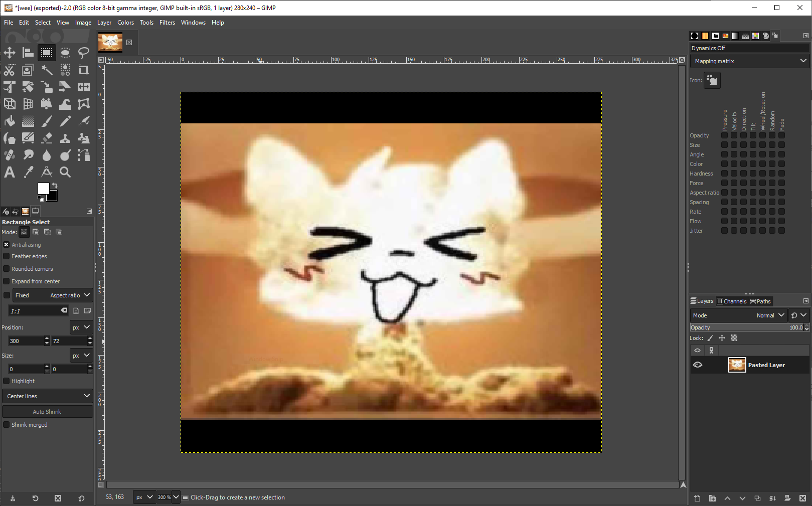
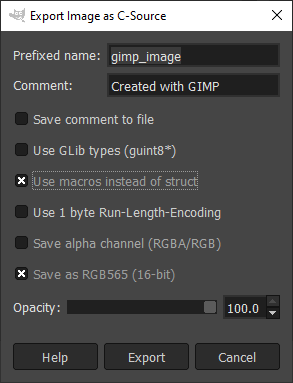

# Example - Simple Image Background

This example demonstrates how to use a simple image as a background for the display.

## Hardware Required
- A Raspberry Pi Pico
- A ST7789 display, any display with a resolution of 240x280 pixels should work

The display can be swapped out with any other display, but the code will need to be modified and the image needs to be regenerated to avoid weird effects.

## Building the Example

This example can be built from the root of the repository using the Visual Studio Code [Raspberry Pi Pico](https://marketplace.visualstudio.com/items?itemName=raspberry-pi.raspberry-pi-pico) extension.

## Generating the Image

Create or copy your image into Gimp.
Resize or alter the image so it fits on the display, this means you need to resize it to the exact pixel dimensions of the display.
For example, the ST7789 display used in this example is 240x280 pixels.



Export the image as a `.c` file, with the following settings:


The image will be created with a header that looks like this:
```c
/* GIMP RGB C-Source image dump (wee.c) */

#define GIMP_IMAGE_WIDTH (280)
#define GIMP_IMAGE_HEIGHT (240)
#define GIMP_IMAGE_BYTES_PER_PIXEL (2) /* 2:RGB16, 3:RGB, 4:RGBA */
#define GIMP_IMAGE_PIXEL_DATA ((unsigned char*) GIMP_IMAGE_pixel_data)
static const unsigned char GIMP_IMAGE_pixel_data[280 * 240 * 2 + 1] =
```
This entire section needs to be removed and replaced with the following:
```c
static const unsigned char background_image[] =
```
Where `background_image` is the name of the variable that will be used in the code. You can name it whatever you want.
Also make sure you remove the last parenthesis from the file ending and replace it with a semicolon to finish the array.

For reference, the [example image file](wee_bg.h) in this repo can be used to verify that you exported it properly

